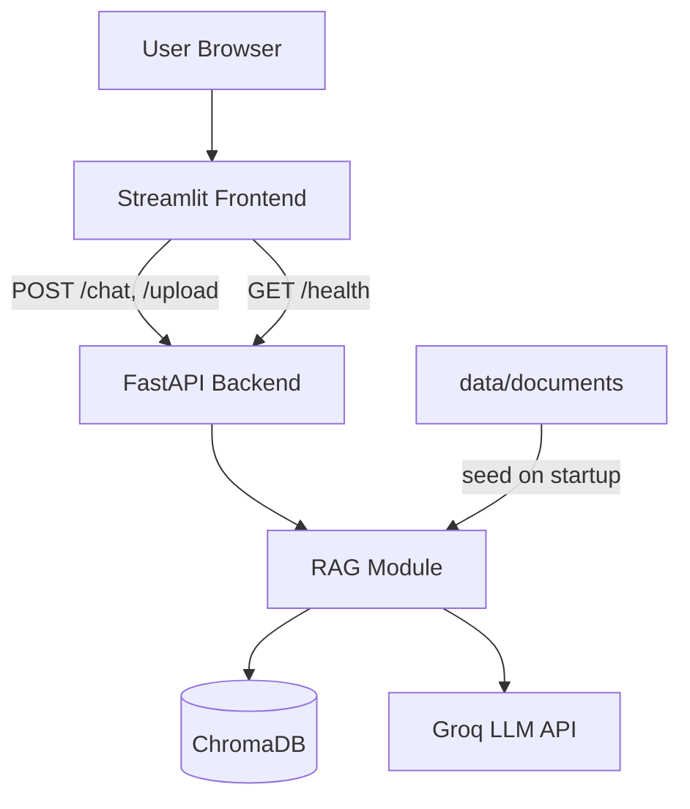
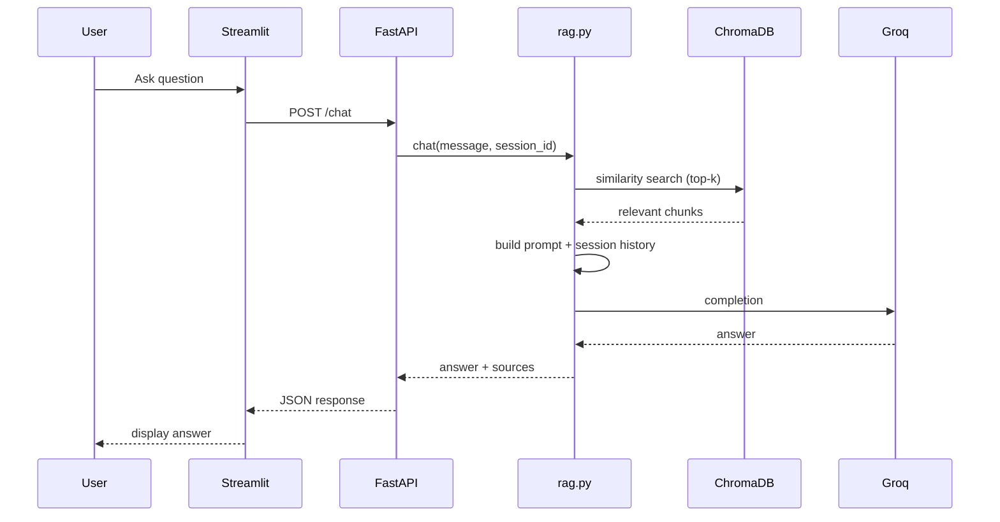

# Architecture

## High-level diagram

## RAG flow

## Components

### Frontend (`frontend/streamlit_app.py`)

- Chat bubbles and `st.session_state` for history
- Unique `session_id` per conversation (context for follow-ups like "what is the rate for it?")
- Sidebar file upload → calls `POST /upload`
- Loading via placeholder text while API responds

### Backend (`backend/main.py`)

- REST endpoints required by the assignment
- CORS enabled for deployed UI
- Lifespan hook runs `seed_if_empty()` so Chroma is populated on boot

### RAG (`backend/rag.py`)

| Step | Implementation |
|------|----------------|
| Ingestion | Read PDF (`pypdf`) or TXT from disk/upload |
| Chunking | Sliding window ~500 chars, 80 overlap |
| Embeddings | SentenceTransformers via Chroma's embedding function |
| Storage | ChromaDB persistent client (`data/chroma/`) |
| Retrieval | Cosine similarity, top 4 chunks |
| Generation | Groq chat completion with strict system prompt |
| Memory | Last 6 turns stored per `session_id` in memory |

### Why these choices (2-day scope)

- **ChromaDB**: zero setup, Python-native, meets vector DB requirement
- **Local embeddings**: no paid embedding API; good enough for FAQ-style docs
- **Groq**: free tier, fast responses for demo
- **Streamlit**: fastest path to a decent chat UI without writing React

## Deployment (Render)

Two web services from `render.yaml`:

1. **banking-chatbot-api** — uvicorn, holds Chroma + seed logic
2. **banking-chatbot-ui** — Streamlit, `API_URL` points to service 1

## Security

- API keys only via environment variables (`.env` locally, Render dashboard in prod)
- Upload restricted to `.pdf` / `.txt`
- Input length capped on `/chat`

## Future improvements

- Redis for session + retrieval cache
- Streaming tokens to UI (SSE)
- Reranker (e.g. cross-encoder) on retrieved chunks
- Persistent volume on Render for Chroma
- CI/CD (GitHub Actions → Render deploy)
- Auth API key for `/upload`
